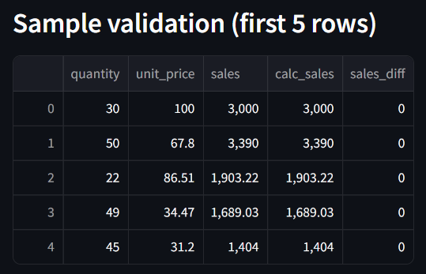
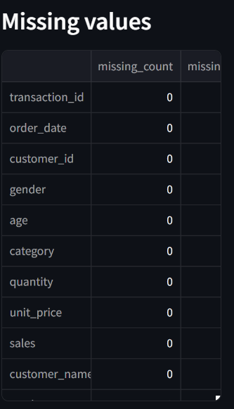
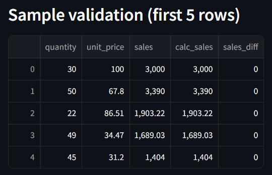

# 🧹 CSV-Cleaner-Pro 🚀  
**Clean, validate, and standardize messy CSV sales data — instantly.**  
*A Python + Streamlit powered automation tool for analysts, businesses, and freelancers.*

[](https://github.com/bibhu342/CSV-Cleaner-Pro/actions)
[](https://csv-cleaner-pro-bibhu342.streamlit.app)

> 💻 **Live Demo:** [Try it on Streamlit Cloud](https://csv-cleaner-pro-bibhu342.streamlit.app) — Upload any CSV and get a cleaned file instantly.


---

## ⚡ Quickstart

### 🧩 CLI Usage
```bash
python scripts/cli.py -i data/raw/sales_dirty.csv -o data/cleaned/sales_cleaned_final.csv

streamlit run scripts/app.py

Then open http://localhost:8501
---

## 🌐 Live Demo  

### 🪄 Before → After Preview
| Input CSV (Raw) | Cleaned CSV (Output) |
|-----------------|----------------------|
|  |  |

### 🪄 Before → Processing → After Demo

<p align="center">
  
</p>

👉 **Try it now (hosted on Streamlit Cloud):**  
🔗 [https://csv-cleaner-pro-qy34r3dkdap9d327sn375l.streamlit.app/](https://csv-cleaner-pro-qy34r3dkdap9d327sn375l.streamlit.app/)

---

## 💡 Problem It Solves  
Real-world CSV files often contain inconsistent column names, mixed date formats, currency symbols, and duplicate rows.  
**CSV-Cleaner-Pro** automates the entire cleaning process using Python + Pandas, instantly transforming raw CSVs into analysis-ready data — saving hours of manual cleanup.

---

## ⚙️ Tech Stack  

| Category | Tools |
|-----------|--------|
| **Language** | Python 3.11 |
| **Framework** | [Streamlit](https://streamlit.io) |
| **Libraries** | Pandas, NumPy, Pathlib |
| **Environment** | VS Code, GitHub, Streamlit Cloud |

---

## 📘 Project Overview

**CSV-Cleaner-Pro** is a production-ready, automated Python tool built to clean and standardize messy sales data in CSV format.
It reads raw datasets, fixes missing and inconsistent values, validates business logic (`sales = quantity × unit_price`), and exports a perfectly cleaned file — ready for analytics, dashboards, or machine learning.

---

## 🎯 Objective

To automate the process of cleaning messy CSV data using **Python + Pandas**,
and wrap it in an interactive **Streamlit UI** for non-technical users to easily upload, preview, and download cleaned files.

---

## 🧩 Data Cleaning Pipeline

### 1️⃣ Data Inspection

* Checked structure, types, and missing values using `df.info()` and `df.isna()`
* Found missing customer names, missing order dates, and duplicate rows

### 2️⃣ Handle Missing Values

```python
df['customer_name'] = df['customer_name'].fillna("Unknown")
df['order_date'] = df['order_date'].fillna("2024-12-31")
```

### 3️⃣ Text Normalization

```python
for col in ['customer_name', 'city', 'category', 'product']:
    df[col] = df[col].astype(str).str.strip().str.title()
```

### 4️⃣ Numeric Cleaning

```python
for col in ['unit_price', 'sales']:
    df[col] = (
        df[col].astype(str)
        .str.replace(r'[^0-9.\-]', '', regex=True)
    )
    df[col] = pd.to_numeric(df[col], errors='coerce')
```

### 5️⃣ Validation & Fixes

```python
df['sales'] = df['quantity'] * df['unit_price']
```

### 6️⃣ Date Cleaning

```python
df['order_date'] = pd.to_datetime(df['order_date'], errors='coerce')
```

### 7️⃣ Finalization

* Removed duplicates
* Sorted chronologically
* Exported cleaned dataset to `data/cleaned/`

---

## 🧾 Final Results

| Metric              | Result                            |
| ------------------- | --------------------------------- |
| Cleaned datasets    | 3 (Global, Retail, USA)           |
| Missing values      | 0 after cleaning                  |
| Duplicates removed  | ✅                                 |
| Valid sales formula | ✅ `sales = quantity × unit_price` |
| Date format         | ISO (`YYYY-MM-DD`)                |

---

## 🧠 Streamlit UI Features

* Upload any `.csv` file (any encoding: UTF-8, latin1, cp1252)
* Cleans data instantly using `clean_sales_data.py`
* Displays preview + metrics + missing value summary
* Download the cleaned CSV directly

### Run the App

```bash
streamlit run scripts/app.py
```

Then open in your browser:
**[http://localhost:8501](http://localhost:8501)**

---

## 📂 Folder Structure

```
CSV-Cleaner-Pro/
│
├── data/
│   ├── raw/              # Raw messy CSVs
│   └── cleaned/          # Cleaned outputs
│
├── scripts/
│   ├── app.py            # Streamlit front-end
│   └── clean_sales_data.py  # Core cleaning logic
│
├── assets/               # Screenshots for README
├── requirements.txt
└── README.md
```

---

## 📊 Datasets Used for Testing

| Dataset                          | Purpose                           | Status |
| -------------------------------- | --------------------------------- | ------ |
| `sales_dirty.csv`                | Internal messy sample (base test) | ✅      |
| `kaggle_test_1_sample_sales.csv` | Global sample sales data          | ✅      |
| `kaggle_test_2_retail_sales.csv` | Retail transaction dataset        | ✅      |
| `kaggle_test_3_sales_usa.csv`    | US-based sales dataset            | ✅      |

---

## 🧠 Key Learnings

* Real-world data cleaning using Pandas
* Handling multi-encoding and multi-locale CSVs
* Automating end-to-end data preprocessing
* Building Streamlit apps for quick ETL workflows

---

## 🚀 Future Enhancements

* Add progress tracking and logging
* Add visualization / EDA mode (sales trends, top categories)
* Export cleaning report as PDF
* Integration with Google Sheets API

---

## 📦 Deliverables

| Item                        | Description                                          |
| --------------------------- | ---------------------------------------------------- |
| ✅ **CLI Tool**              | Command-line cleaner with `--input`, `--output` args |
| ✅ **Streamlit App**         | Web interface for upload → clean → download          |
| ✅ **CI-Tested Codebase**    | Automated tests + GitHub Actions                     |
| ✅ **Example Data & Report** | Sample `sales_dirty.csv` + cleaning summary          |
| ✅ **Documentation**         | README + demo screenshots + usage guide              |

---

## 👨‍💻 Author

**Bibhudendu Behera**  
🚀 Aspiring AI Engineer | Freelance Data Specialist  
📍 Bangalore, India  
🔗 [LinkedIn](https://www.linkedin.com/in/bibhudendu-behera-b5375b5b)
💼 [GitHub](https://github.com/bibhu342)
📧 bibhu342@gmail.com
🎯 [Fiverr Profile](https://www.fiverr.com/s/7YEbRPk)
---

## 📜 License

MIT License © 2025 — free to use and modify with attribution.

---